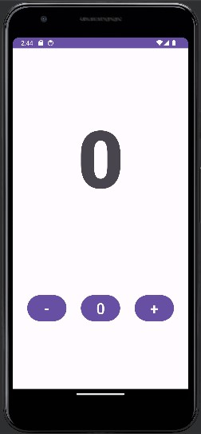
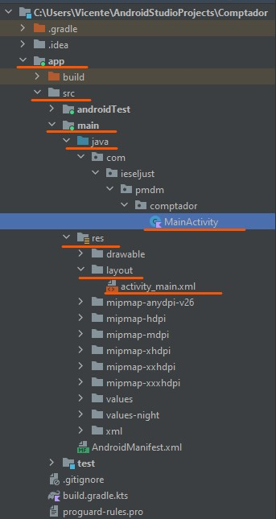
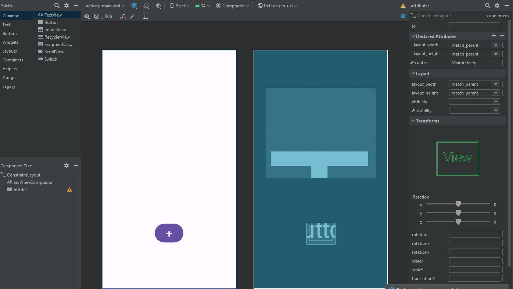
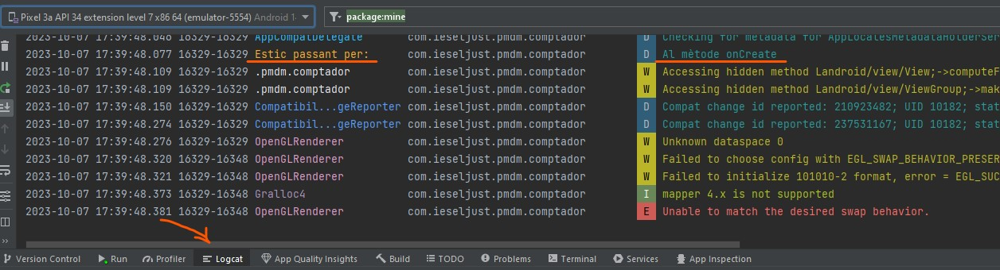
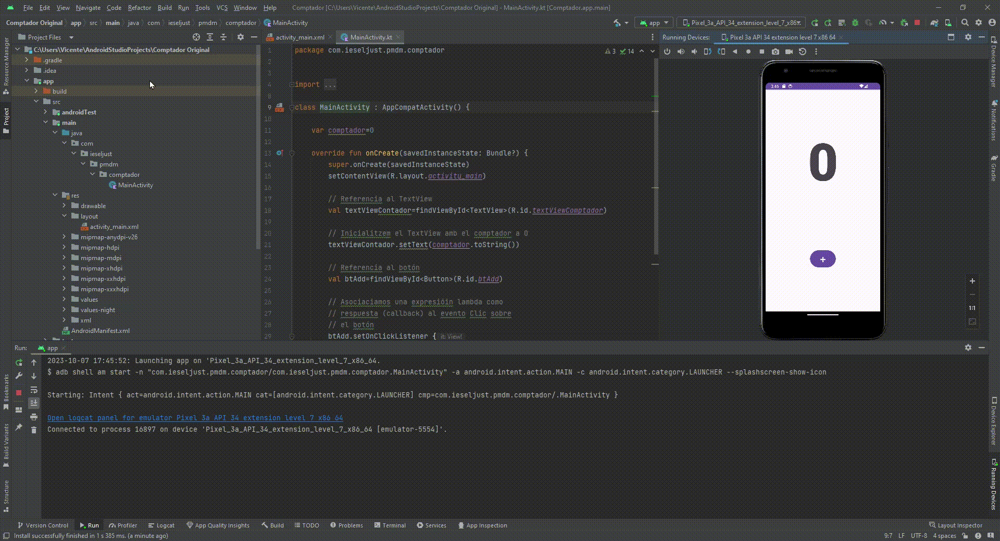
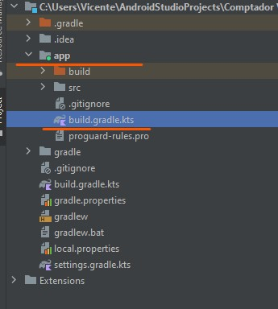
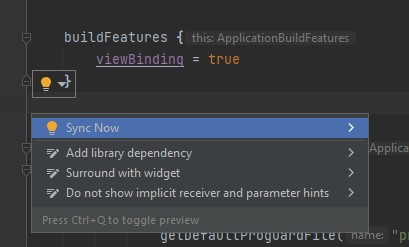

# **PROJECTE APP COMPTADOR** 
## MEMÒRIA:
### 1. ANÀLISI DE L'ESTRUCTURA DEL PROJECTE
El projecte a desenvolupar és tracta d'una aplicació android amb una única activitat, composta per un comptador i un botó que incrementa aquest comptador quan és fa clic sobre ell. 



Aquest projecte està basat amb l'estructura Gradle i presenta un arbre de fitxers bastant extens, amb el qual ens haurem de fixar amb els més importants que son:




* MainActivity.tk
    - Quan generem una aplicació basada en un projecte de tipus Empty Activity (o Emty View Activity en aquest cas), se’ns genera una classe principal MainActivity on s'implementarà el codi per a construir el comportament de les activitat de la nostra aplicació.

* activity_main.xml
    - Aquests fitxers XML contenen el disseny amb els diferents elements de la interfície d’usuari, les activitats. Malgrat ser un fitxer XML, Android Studio ens mostra una interfície WYSIWYG (What you see is what you get), de manera que veiem el disseny de la pantalla, junt amb una paleta de components que podem arrossegar i soltar, així com els atributs de cada element de la interfície.

    

* AndroidManifest.xml 
    - El fitxer de Manifest és un fitxer propi de cada aplicació que conté informació sobre aquesta. Aquesta informació s’utilitza per part tant de les eines de creació d’Android, com pel propi sistema i per Google Play.


Com que ja saben on son ubicades les activitats anem a analitzar-ne una.
Ens ubicarem a 
>Comptador\app\src\main\res\layout\activity_main.xml

I podrem observar la següent estructura:
```xml
        <Button
                android:id="@+id/btAdd"
                android:layout_width="wrap_content"
                android:layout_height="wrap_content"
                android:text="+"
                android:textSize="34sp"
                app:layout_constraintBottom_toBottomOf="parent"
                app:layout_constraintEnd_toEndOf="parent"
                app:layout_constraintStart_toStartOf="parent"
                app:layout_constraintTop_toBottomOf="@+id/textViewComptador" />
```
 
    

Aquesta activitat es la associada al botó que ens permetrà incrementar el marcador cada vegada que el polsem.
    


### 2. ANÀLISI DEL CICLE DE VIDA I ELS PROBELEMES DE LA PÈRDUA D'ESTAT

Les activitats i la forma en què aquestes s’inicien i relacionen són part fonamental del model d’aplicació d’Android.

Una aplicació Android pot compondre’s de diverses activitats, i a pesar que aquestes treballen conjuntament per a donar una experiència d’usuari coherent, en realitat tenen poca relació entre elles, la qual cosa facilita la invocació d’activitats entre diferents aplicacions.

Les activitats, al llarg de la seua vida útil, passen per diferents estats. L’usuari de l’aplicació pot obrir-la, tancar-la, obrir una altra aplicació… En aquestes transicions entre estats es disparen certs esdeveniments, que podem capturar i gestionar mitjançant funcions de callback.

Els callbacks que podem implementar en la classe Activity per tal de capturar aquests esdeveniments del cicle de vida són:

* onCreate(): S’activa en la creació de l’activitat i s’usa per a inicialitzar els seus components, enllaçar les vistes vincular les dades. En aquest mètode és on generalment utilitzem setContentView() per a establir el layout de la interfície.

* onStart(): S’activa després del callback onCreate(), quan ja s’ha iniciat l’activitat i aquesta passa a primer pla, tornant-se visible per a l’usuari.

* onResume(): Es dispara just abans que l’activitat comence a interactuar amb l’usuari, i es troba dalt de tot de la pila d’activitats.

* onPause(): S’invoca quan l’activitat perd el focus i passa a l’estat de Pausada (per exemple, s’ha premut el botó d’arrere o Recents). Quan el sistema invoca onPause(), l’activitat encara és parcialment visible. Les activitats pausades poden continuar actualitzant la interfície si l’usuari espera que això passe (com per exemple, actualitzar un mapa de navegació). Aquest callback no s’ha d’utilitzar per a guardar dades de l’aplicació, de l’usuari, fer crides de xarxa o realitzar transaccions sobre bases de dades.

* onStop(): S’invoca quan l’activitat ja no és visible per a l’usuari, bé perquè s’estiga eliminant aquesta, perquè s’inicia una activitat nova o perquè es reprenga una altra que la cobrisca.

* onRestart(): S’invoca quan una activitat que estava Detinguda passa de nou a estar en primer pla. Aquest callback, restaura l’estat de l’activitat en el moment en què aquesta es va detindre. Després d’aquest callback, s’invoca sempre onStart().

* onDestroy(): S’invoca aquest callback abans que s’elimine l’activitat, i s’usa per a garantir que els seus recursos s’alliberen amb ella, i el procés que la conté s’elimine.

Anem a veure amb el mètode Log com transcorre la nostra activitat per el cicle onCreate:
Ens dirigirem:
>Comptador\app\src\main\java\com\ieseljust\pmdm\comptador\MainActivity.kt

I afegirem aquest codi:

```kotlin
class MainActivity : AppCompatActivity() {
    val TAG = "Estic passant per: "
    var comptador=0
    override fun onCreate(savedInstanceState: Bundle?) {
        super.onCreate(savedInstanceState)
        Log.d(TAG, "Al mètode onCreate")
        setContentView(R.layout.activity_main)
        .
        .
        .
        .

```

I ens fixarem amb les línies: 

```kotlin
val TAG = "Estic passant per: "
.
.
.
Log.d(TAG, "Al mètode onCreate")
```
Així quan executem el programa, podem veure al registre del logcat per on està passant:




### 3. SOLUCIÓ D LA PÈRDUA D'ESTAT
Aquest programa tal i com ens el hem trobat, funciona molt bé, però té un xicotet error i és que al girar la pantalla no ens guarda la puntuació acumulada: 



Per tal de solucionar-ho en dirigirem al fitxer del MainActivity.kt e implementarem el següent codi:

```kotlin
// Guardem els valors amb el mètode onSaveInstanceState creant un objecte estat de la Clase Bundle
    override fun onSaveInstanceState(estat: Bundle) {
        super.onSaveInstanceState(estat)

        // Posem al objecte estat el valor de comptador donant-li una clau,id o nom contador
        estat.putInt("contador", comptador)
    }

    //Amb el mètode onRestoreInstanceState li passem un objecte Bundle
    override fun onRestoreInstanceState(estat: Bundle) {
        super.onRestoreInstanceState(estat)

        //asignem a la variable comptador el valor que em guardat amb onSaveInstanceState diguenli la clau
        comptador = estat.getInt("contador")
        //actualitzem el textView
        val textViewContador = findViewById<TextView>(R.id.textViewComptador)
        textViewContador.text = comptador.toString()
                                             
    }
```
Al implementar les funcions onSaveInstanceState i onRestoreInstanceState el que hem fet ha sigut solucionar el problema del canvi d'estat.


### 4. AMPLIANT LA FUNCIONALITAT AMB DECREMENTS I RESET

A continuació anem afegir dues funcionalitats noves a la nostra aplicació o millor dit dues activitats, el botó de decrement i el botó de restaurar. 
Aleshores el que farem serà modificar el fitxer activity_main.xml de la següent manera:

```xml
 <?xml version="1.0" encoding="utf-8"?>
<androidx.constraintlayout.widget.ConstraintLayout xmlns:android="http://schemas.android.com/apk/res/android"
    xmlns:app="http://schemas.android.com/apk/res-auto"
    xmlns:tools="http://schemas.android.com/tools"
    android:layout_width="match_parent"
    android:layout_height="match_parent"
    tools:context=".MainActivity">

        <TextView
            android:id="@+id/textViewComptador"
            android:layout_width="338dp"
            android:layout_height="276dp"
            android:fontFamily="sans-serif-black"
            android:textAlignment="center"
            android:textSize="178sp"
            app:layout_constraintBottom_toBottomOf="parent"
            app:layout_constraintLeft_toLeftOf="parent"
            app:layout_constraintRight_toRightOf="parent"
            app:layout_constraintTop_toTopOf="parent"
            app:layout_constraintVertical_bias="0.255" />

        <Button
            android:id="@+id/btResta"
            android:layout_width="wrap_content"
            android:layout_height="wrap_content"
            android:text="-"
            android:textSize="34sp"
            app:layout_constraintBottom_toBottomOf="parent"
            app:layout_constraintEnd_toStartOf="@+id/btReset"
            app:layout_constraintStart_toStartOf="parent"
            app:layout_constraintTop_toBottomOf="@+id/textViewComptador" />

        <Button
            android:id="@+id/btReset"
            android:layout_width="wrap_content"
            android:layout_height="wrap_content"
            android:text="0"
            android:textSize="34sp"
            app:layout_constraintBottom_toBottomOf="parent"
            app:layout_constraintEnd_toStartOf="@+id/btAdd"
            app:layout_constraintStart_toEndOf="@+id/btResta"
            app:layout_constraintTop_toBottomOf="@+id/textViewComptador" />

        <Button
            android:id="@+id/btAdd"
            android:layout_width="wrap_content"
            android:layout_height="wrap_content"
            android:text="+"
            android:textSize="34sp"
            app:layout_constraintBottom_toBottomOf="parent"
            app:layout_constraintEnd_toEndOf="parent"
            app:layout_constraintStart_toEndOf="@+id/btReset"
            app:layout_constraintStart_toEndtOf="@+id/btReset"
            app:layout_constraintTop_toBottomOf="@+id/textViewComptador" />

</androidx.constraintlayout.widget.ConstraintLayout>
```
Un cop fet açò ens dirigirem al fitxer MainActivity.kt i implementarem el codi per a donar-li funcionalitat als botons que hem creat, deixant finalment el projecte d'aquesta manera:

```kotlin
class MainActivity : AppCompatActivity() {
    val TAG = "Estic passant per: "
    var comptador=0
    override fun onCreate(savedInstanceState: Bundle?) {
        super.onCreate(savedInstanceState)
        Log.d(TAG, "Al mètode onCreate")
        setContentView(R.layout.activity_main)

        // Referencia al TextView
        val textViewContador=findViewById<TextView>(R.id.textViewComptador)

        // Inicialitzem el TextView amb el comptador a 0
        textViewContador.setText(comptador.toString())

        // Referencia al botón d'increment
        val btAdd=findViewById<Button>(R.id.btAdd)

        // Referencia al botón de restar
        val btResta=findViewById<Button>(R.id.btResta)

        // Referencia al botón d'increment
        val btReset=findViewById<Button>(R.id.btReset)

        // Asociaciamos una expresióin lambda como
        // respuesta (callback) al evento Clic sobre
        // el botón +
        btAdd.setOnClickListener {
            comptador++
            textViewContador.setText(comptador.toString())
        }

        // Asociaciamos una expresióin lambda como
        // respuesta (callback) al evento Clic sobre
        // el botón -
        btResta.setOnClickListener {
            if (comptador == 0){
                comptador = 0
            }else{
                comptador--
                textViewContador.setText(comptador.toString())
            }
        }

        // Asociaciamos una expresióin lambda como
        // respuesta (callback) al evento Clic sobre
        // el botón reset
        btReset.setOnClickListener {
            comptador=0
            textViewContador.setText(comptador.toString())
        }

    }
    // Guardem els valors amb el mètode onSaveInstanceState creant un objecte estat de la Clase Bundle
    override fun onSaveInstanceState(estat: Bundle) {
        super.onSaveInstanceState(estat)

        // Posem al objecte estat el valor de comptador donant-li una clau,id o nom contador
        estat.putInt("contador", comptador)
    }

    //Amb el mètode onRestoreInstanceState li passem un objecte Bundle
    override fun onRestoreInstanceState(estat: Bundle) {
        super.onRestoreInstanceState(estat)

        //asignem a la variable comptador el valor que em guardat amb onSaveInstanceState diguenli la clau
        comptador = estat.getInt("contador")
        //actualitzem el textView
        val textViewContador = findViewById<TextView>(R.id.textViewComptador)
        textViewContador.text = comptador.toString() // ho psem aixi perque es com ho recomana AStudio
                                                    
    }

}
```
Vegem la funcionalitat final:


### 5. CANVIS PER IMPLEMANTER EL VIEW BINDING

 A aquest apartat anem a implementar el view binding seguit els següents passos:

1. Activar el ViewBinding a les buildFeatures de l’script Gradle del mòdul.
    * Ens dirigim a la següent ruta i afegim a la secció d’android el següent codi:

 
```kotlin
    buildFeatures {
        viewBinding = true
    }
```
2. Sincronitzar el projecte amb aquest script, per a que genere les classes de vinculació,
polsant la perilla que ens proporciona el ID i li diguem que ens ho sincronitze:

 

3. Importem la classe de vinculació en el fitxer de la classe on l’anem a utilitzar:
    * Ara anem al fitxer MainActivity.kt
    i afegim el següent codi a la part on tenim tots els imports:

    >import com.ieseljust.pmdm.comptador.databinding.ActivityMainBinding

4. Declarar l’objecte (binding) que accedirà a aquesta classe (generalment com a lateinit) i definir-lo mitjançant l’unflat de la vista.
```kotlin
class MainActivity : AppCompatActivity() {
    val TAG = "Estic passant per: "

    private lateinit var binding: ActivityMainBinding
    override fun onCreate(savedInstanceState: Bundle?) {
        super.onCreate(savedInstanceState)
        binding= ActivityMainBinding.inflate(layoutInflater)
        .....
    }
}
```
5. Modificar el SetContentView per afegir-lo l’arrel del binding (binding.root).

```kotlin
        val view = binding.root
        Log.d(TAG, "Al mètode onCreate")
        setContentView(view)
```
6. Accedir als elements de la interfície a través d’aquest objecte de vinculació.

    * Ara substituïm:
    ```kotlin
    val textViewContador=findViewById<TextView>(R.id.textViewComptador)
    textViewContador.setText(comptador.toString())
    ``` 
    Per:
    ```
    binding.textViewComptador.setText(comptador.toString())
    ```
    * Amb això, a través de l’objecte binding, podrem accedir a les diferents vistes de la interfície com si es tractara de propietats d’aquest objecte, el nom del qual correspon al de l’ID de la vista. Per exemple si tenim un TextView amb l’ID textView, podrem accedir a aquest mitjançant binding.textView i amb .setText(comptador.toString()) li estem passant o millor dit assignant el valor de la variable comprador. 
    Ho farem aixi amb la resta de codi tal que axí:

    ```kotlin
    class MainActivity : AppCompatActivity() {
    val TAG = "Estic passant per: "

    private lateinit var binding: ActivityMainBinding

    var comptador=0

    override fun onCreate(savedInstanceState: Bundle?) {
        super.onCreate(savedInstanceState)
        binding= ActivityMainBinding.inflate(layoutInflater)
        val view = binding.root
        Log.d(TAG, "Al mètode onCreate")
        setContentView(view)

        val textViewContador = binding.textViewComptador
        val btAdd = binding.btAdd
        val btResta = binding.btResta
        val btReset = binding.btReset


        btAdd.setOnClickListener {
            comptador++
            binding.textViewComptador.setText(comptador.toString())
        }

        
        btResta.setOnClickListener {
            if (comptador == 0){
                comptador = 0
            }else{
                comptador--
                binding.textViewComptador.setText(comptador.toString())
            }
        }

        btReset.setOnClickListener {
            comptador=0
            binding.textViewComptador.setText(comptador.toString())

        }

    }
    
    override fun onSaveInstanceState(estat: Bundle) {
        super.onSaveInstanceState(estat)

        estat.putInt("contador", comptador)
    }

    override fun onRestoreInstanceState(estat: Bundle) {
        super.onRestoreInstanceState(estat)

        
        comptador = estat.getInt("contador")
       
        val textViewContador = findViewById<TextView>(R.id.textViewComptador)
        textViewContador.text = comptador.toString()
                                                   
        }
    }
```

